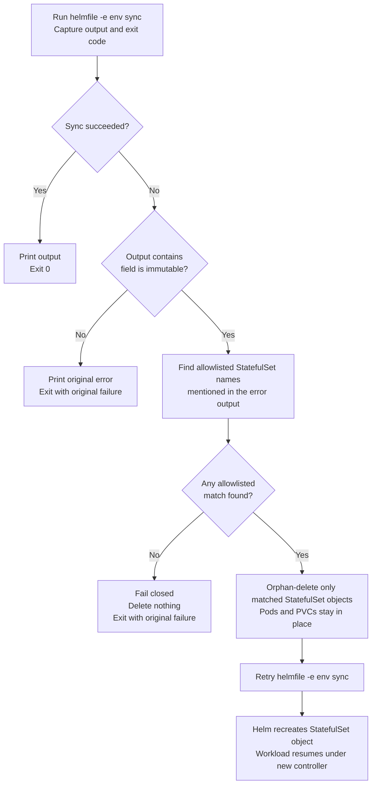

# Corp Deployment Quickstart (Phase 1)

> Minimal steps to deploy gpu-mon to the airgapped corp cluster.
> For full design and Phase 2/3 evolution, see [corp-deployment-strategy.md](corp-deployment-strategy.md).

## Prerequisites

- Docker CLI + `yq` installed on WSL
- Authenticated to both GHCR and corp registry (`docker login`)
- `gpu-mon-corp` private repo cloned alongside this repo

### One-time symlink setup

The public `gpu-mon` repo contains all charts, source code, and environment-agnostic config.
Corp-specific details (registry URLs, node IPs, credentials, notification channels) live in the
separate **private** `gpu-mon-corp` repo to avoid leaking company-specific data.

Symlinks bridge the two repos so that tools like Helmfile and Ansible can find corp configs
at their expected paths without committing secrets to the public repo:

```bash
cd ~/work/gpu-mon/environments/
ln -s ../../gpu-mon-corp/environments/corp ./corp
# → Helmfile values for corp env (registry URL, image overrides, Helm values)

cd ~/work/gpu-mon/ansible/inventory/
ln -s ../../../gpu-mon-corp/ansible/inventory/corp.ini ./corp.ini
# → Ansible inventory (corp node IPs, SSH config for baremetal/VM agent deployment)

cd ~/work/gpu-mon/ansible/vars/
ln -s ../../../gpu-mon-corp/ansible/vars/corp.yaml ./corp.yaml
# → Ansible variable overrides (agent versions, Vector endpoint, metadata labels)

cd ~/work/gpu-mon/alerting/alertmanager/
ln -s ../../../gpu-mon-corp/alerting/alertmanager/corp.yaml ./corp.yaml
# → Alertmanager routing (corp notification channels, escalation rules)
```

These paths are gitignored (`environments/corp/`, `**/corp*`), so the symlinks
themselves are never committed. See `environments/corp.example/` for the expected
structure without real values.

## Deploy

```bash
cd ~/work/gpu-mon
git pull && cd ../gpu-mon-corp && git pull && cd ../gpu-mon

# Sync images + deploy (one command)
make corp-deploy CORP_REGISTRY=registry.corp.internal

# Verify
kubectl -n monitoring get pods
```

## Grafana plugin carrier image

In corp, Grafana runs with `grafana_plugins_init: true`, so plugins are loaded
from the `grafana-plugins` carrier image instead of being downloaded from
grafana.com at pod startup.

CI automatically builds and pushes the `grafana-plugins` image to GHCR using
the tag from `versions.yaml -> custom_images.grafana-plugins` when either of
these change:

- `src/grafana-plugins/**` (Dockerfile)
- `versions.yaml` (plugin versions under `grafana_plugins`)

It also rebuilds when that configured GHCR tag is missing.

`make corp-deploy` then mirrors the image from GHCR into the corp registry
alongside all other custom images.

To build locally (e.g. for testing): `make build-grafana-plugins`

## What `make corp-deploy` does

1. Pre-flight validation (`validate-corp-setup.sh`) checks symlinks and required files
2. StorageClass `spectrum-scale` is created if absent in the cluster (skipped if it already exists; fails if the manifest file is missing)
3. `corp-sync-images.sh` reads `versions.yaml`, pulls images from GHCR/DockerHub, and pushes them to the corp registry (includes the `grafana-plugins` carrier image when listed under `custom_images`)
4. `helmfile -e corp diff` previews changes
5. `./scripts/helmfile-sync.sh corp` runs the Helmfile sync with a narrow StatefulSet immutable-field recovery path

If `grafana_plugins_init: true` is set in `environments/corp/values.yaml`, the
Grafana release mounts an `emptyDir`, runs an init container from the
`grafana-plugins` image, and starts Grafana with `plugins: []` so no internet
download is required from the cluster.

## Helmfile sync retry flow

`make corp-deploy`, `make corp-sync`, and `make homelab-sync` all call
`./scripts/helmfile-sync.sh <environment>` instead of invoking `helmfile sync`
directly.

The wrapper exists for one specific Kubernetes limitation: some StatefulSet
fields are immutable after creation, especially fields under
`volumeClaimTemplates`. If Helm tries to patch one of those fields in place, the
API server rejects the update and the sync fails.

### Flow description

1. Run `helmfile -e <environment> sync` and capture the output plus exit code.
2. If the sync succeeds, print the output and exit normally.
3. If the sync fails for a reason other than `field is immutable`, return the original failure unchanged.
4. If the sync fails with an immutable-field error, scan the error output for allowlisted StatefulSet names.
5. If no allowlisted StatefulSet is explicitly named in the error output, fail closed and delete nothing.
6. If one or more allowlisted StatefulSets are named, delete only those StatefulSet objects with `kubectl delete statefulset ... --cascade=orphan`.
7. Retry the same `helmfile -e <environment> sync`.
8. On the retry, Helm recreates the missing StatefulSet object with the new spec while the existing pods and PVCs remain in place.

### Why orphan-delete is used

- `--cascade=orphan` deletes the StatefulSet object only.
- Existing pods keep running instead of being torn down immediately.
- Existing PVCs remain attached to the workload identity.
- The retry can recreate the controller object without automatically touching unrelated healthy resources.

### Safety guard

The recovery path is intentionally narrow.

- The script only considers StatefulSets listed in its internal allowlist.
- The script only orphan-deletes a StatefulSet if that exact name appears in the immutable-field error output.
- If another resource fails, or a different StatefulSet such as `vector` fails, the wrapper exits with the original error and performs no deletion.

### Flowchart



### Controller and workload effect

```text
Before orphan-delete:
  StatefulSet ----owns----> Pods + PVCs

After kubectl delete statefulset --cascade=orphan:
  StatefulSet    removed
  Pods           still running
  PVCs           still present

After retry sync:
  Helm recreates StatefulSet object
  Kubernetes re-associates the controller with the existing workload
```

## Rollback

```bash
# Single release
helm -n monitoring rollback <release-name> <revision>

# Full rollback to a previous version
git checkout v1.1.0
make corp-deploy CORP_REGISTRY=registry.corp.internal
```
