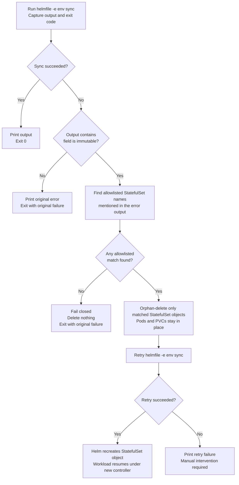

# Helmfile Sync Retry Flow

> Detailed description of [`scripts/helmfile-sync.sh`](../scripts/helmfile-sync.sh) — the wrapper used by `make corp-deploy`, `make corp-sync`, and `make homelab-sync`.

## Why this wrapper exists

Kubernetes StatefulSet `spec.volumeClaimTemplates` fields are immutable after creation (PVC size, storageClassName, accessModes). When Helm tries to update these fields in place, the API server rejects the change and `helmfile sync` fails.

The wrapper detects this specific failure, orphan-deletes only allowlisted StatefulSets (pods and PVCs keep running), and retries the sync so Helm can recreate the StatefulSet object with the new spec.

## Flow description

1. Run `helmfile -e <environment> sync` and capture the output plus exit code.
2. If the sync succeeds, print the output and exit normally.
3. If the sync fails for a reason other than `field is immutable`, return the original failure unchanged.
4. If the sync fails with an immutable-field error, scan the error output for allowlisted StatefulSet names.
5. If no allowlisted StatefulSet is explicitly named in the error output, fail closed and delete nothing.
6. If one or more allowlisted StatefulSets are named, delete only those StatefulSet objects with `kubectl delete statefulset ... --cascade=orphan`.
7. Retry the same `helmfile -e <environment> sync`.
8. On the retry, Helm recreates the missing StatefulSet object with the new spec while the existing pods and PVCs remain in place.

## Why orphan-delete is used

- `--cascade=orphan` deletes the StatefulSet object only.
- Existing pods keep running instead of being torn down immediately.
- Existing PVCs remain attached to the workload identity.
- The retry can recreate the controller object without automatically touching unrelated healthy resources.

## Safety guards

The recovery path is intentionally narrow.

- The script only considers StatefulSets listed in its internal allowlist (currently only `vmstorage`).
- The script only orphan-deletes a StatefulSet if that exact name appears in the immutable-field error output.
- If another resource fails, or a non-allowlisted StatefulSet such as `vector` fails, the wrapper exits with the original error and performs no deletion.
- ClickHouse StatefulSets are operator-managed and excluded — immutable field changes on ClickHouse require `ClickHouseInstallation` CR recreation through the operator.

## Flowchart



## Controller and workload effect

```text
Before orphan-delete:
  StatefulSet ----owns----> Pods + PVCs

After kubectl delete statefulset --cascade=orphan:
  StatefulSet    removed
  Pods           still running
  PVCs           still present

After retry sync:
  Helm recreates StatefulSet object
  Kubernetes re-associates the controller with the existing workload
```

## Other sync blockers (not handled by this wrapper)

| Category | Risk | Notes |
|---|---|---|
| ClickHouse StatefulSet (operator-managed) | Critical | Requires CHI CR recreation, not orphan-delete |
| Service `spec.type` change | Medium | ClusterIP→LoadBalancer needs delete+recreate |
| CRD not ready (ClickHouse) | High | Already mitigated by `needs:` in helmfile |
| Storage provisioning (no StorageClass) | High | Already mitigated by `corp-ensure-sc` target |
| Image pull failure (corp airgap) | High | Mitigated by `corp-sync-images.sh` pre-step |
| Config syntax errors | High | Caught by `helmfile lint` / `make lint` |
